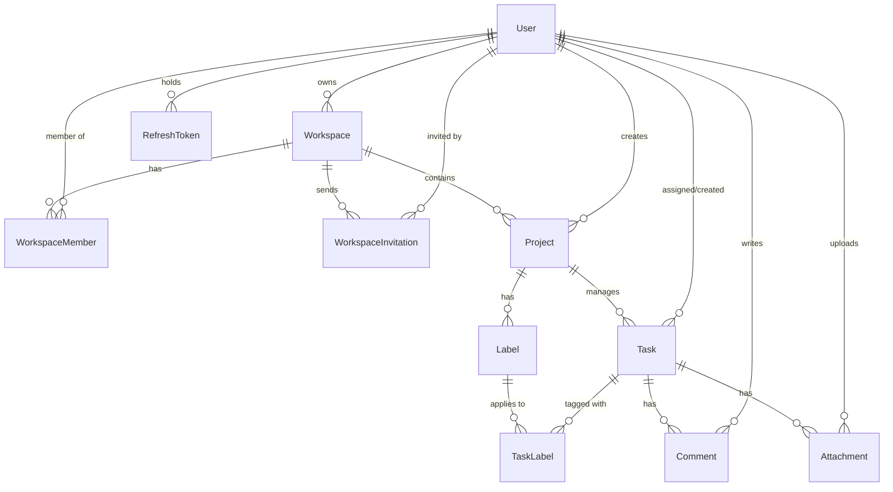

# TASKPULSE Project Handover & Continuation Context

This document serves as a comprehensive system overview, architecture description, and hand-off guide for the **TASKPULSE** project. It contains all the context needed for a new developer or AI assistant to continue development immediately.

---

## 1. Project Overview

*   **Project Name:** TASKPULSE
*   **Purpose:** A collaborative task and project management application featuring real-time synchronization, interactive Kanban boards, fine-grained workspace roles, and built-in email notification workflows.
*   **Current Development Stage:** Concluding Phase 2 (Realtime integration, validation fixes, and base64 attachment fallback) and transitioning into Phase 3 (Production scaling, AWS S3 file storage, and deployment).
*   **University Project Context:** Developed as a group project to demonstrate full-stack software development practices, real-time networking (Socket.IO), persistent relational data modeling (Prisma/MySQL), and secure token-based authentication.

---

## 2. Technology Stack

### Frontend
*   **Core Framework:** React (Vite-based setup)
*   **State Management:** Redux Toolkit (Slices for auth, tasks, workspaces, projects, filters, and settings)
*   **Styling:** Tailwind CSS with vanilla CSS extensions for custom components and glassmorphism elements
*   **Icons & Assets:** Lucide React
*   **Charts:** Recharts (pie charts, bar charts on dashboard)
*   **Realtime Client:** `socket.io-client`

### Backend
*   **Runtime:** Node.js (Express framework)
*   **Database Client:** Prisma ORM
*   **Realtime Server:** Socket.IO (version 4.x)
*   **Security:** Helmet (header security), CORS, bcryptjs (password hashing)
*   **Mailing:** Nodemailer (configured with Gmail SMTP)
*   **Documentation:** Swagger UI (`swagger-ui-express`)

### Database
*   **Engine:** MySQL
*   **Provider/Hosting:** Local MySQL instance (e.g., XAMPP/WampServer) or remote RDS

### Authentication & Sessions
*   **Token Setup:** Dual-token JWT architecture (Short-lived httpOnly Access Token cookie + long-lived httpOnly database-backed Refresh Token cookie).

### File Storage
*   **Current State:** Base64 data-URI strings stored directly in the MySQL `fileUrl` `TEXT` column (max 64KB).
*   **Disabled Config:** Cloudinary config exists (`src/config/cloudinary.js`) but is bypassed to match the frontend JSON upload payload.

---

## 3. Folder Structure

### Root Directory
*   `prisma/`: Prisma schema and migration history.
*   `src/`: Main backend codebase.
*   `frontend/`: Frontend React application.

### Backend Structure (`src/`)
```txt
src/
├── config/             # Third-party services configuration
│   ├── db.js           # Prisma client initializer
│   ├── socket.js       # Base Socket.IO initialization and online user tracking
│   ├── cloudinary.js   # Multer storage configuration for Cloudinary (disabled)
│   └── swagger.js      # Swagger spec configurations
├── controllers/        # Express handlers processing HTTP requests
│   ├── authController.js        # Auth flows (Register, Login, OTP, Resets)
│   ├── workspaceController.js   # Workspaces, members, roles, stats
│   ├── projectController.js     # Projects list, CRUD, project-level stats
│   ├── taskController.js        # Tasks CRUD, labels, comments, attachments
│   ├── userController.js        # Member management (creating, deactivating)
│   ├── invitationController.js  # Workspace invites (creation, accept, resend)
│   └── notificationController.js# Notification retrieval (placeholder)
├── middleware/         # Custom Express middlewares
│   ├── authMiddleware.js        # Parses and validates Access Token JWT cookies
│   ├── ensurePasswordChanged.js # Restricts access if mustResetPassword is true
│   ├── roleMiddleware.js        # Restricts routes based on system role
│   ├── requireWorkspaceAdmin.js # Restricts actions to Workspace Administrators
│   ├── validateAdminUser.js     # Validates parameters for manual user creation
│   ├── validateRegister.js      # Register schema validation
│   └── errorMiddleware.js       # Global error catcher returning JSON format
├── routes/             # Maps API paths to Controller methods
│   ├── authRoutes.js            # /api/auth/*
│   ├── workspaceRoutes.js       # /api/workspaces/*
│   ├── projectRoutes.js         # /api/workspaces/:workspaceId/projects/* (nested)
│   ├── taskRoutes.js            # /api/projects/* (detailed task and project CRUD)
│   └── invitationRoutes.js      # /api/invitations/*
├── services/           # DB interactions & heavy business logic
│   ├── accessService.js         # Unified RBAC, Workspace membership & Task access logic
│   ├── authTokenService.js      # Sign Access Token, generate/rotate/revoke Refresh Tokens
│   ├── emailService.js          # Predefined Nodemailer HTML templates and send functions
│   ├── workspaceService.js      # DB transactions for workspaces and members
│   ├── projectService.js        # Workspace default project and general project services
│   ├── taskService.js           # Queries/mutations for tasks, comments, and attachments
│   ├── userService.js           # Workspace member activation, updates, manual creation
│   └── invitationService.js     # Tokens generation, emails trigger, invitation acceptance
├── socket/             # Extended Socket.IO handlers (Phase 2 realtime setup)
│   ├── events.js                # String constants mapping realtime events
│   ├── socketAuth.js            # Parses cookies and verifies JWTs for Socket clients
│   └── socketHandler.js         # Room joining (join:user, join:workspace, join:project)
├── utils/              # Utility files and constant helpers
│   ├── authCookie.js            # Sets/clears cookies, extracts tokens from headers/cookies
│   ├── workspaceRoles.js        # Defines roles (ADMINISTRATOR, PROJECT_MANAGER, COLLABORATOR)
│   ├── invitationRoles.js       # Constants for invitation statuses and helper normalizers
│   ├── passwordPolicy.js        # Minimum password complexity checkers
│   └── response.js              # Standard API JSON success/error response helpers
└── app.js              # Main Express startup, server wrapper, CORS, and routing mounting
```

### Frontend Structure (`frontend/src/`)
```txt
frontend/src/
├── components/         # Reusable layouts and widgets
│   ├── ui/             # Core UI components (Badge, Button, Card, Loader, etc.)
│   ├── kanban/         # Components specific to the Kanban board view
│   ├── tasks/          # Components specific to Tasks list and creation modal
│   ├── Layout.jsx      # Dashboard sidebar & top navbar structure
│   ├── Sidebar.jsx     # Side menu listing joined workspaces and navigation links
│   └── Footer.jsx      # App footer displaying copyright and links
├── context/            # React context providers
│   ├── AuthContext.jsx # Local user state sync wrapper
│   └── SocketContext.jsx# Socket provider initializing connection after auth
├── pages/              # Routing views
│   ├── auth/           # Login, Register, ForgotPassword, ResetPassword, VerifyOtp
│   ├── Dashboard.jsx   # Stats, charts, online users, notifications list
│   ├── Kanban.jsx      # Draggable board showing workspace tasks
│   ├── Profile.jsx     # Profile edit page (name, bio, profile photo)
│   ├── Settings.jsx    # User settings panel
│   ├── TaskDetail.jsx  # Task visual popup containing comments and attachments
│   └── Workspaces.jsx  # Workspace selector screen
├── services/           # Axios backend APIs connection layer
│   ├── api.js          # Custom Axios client with base credentials settings
│   ├── socket.js       # Websocket client wrapper managing listeners and rooms
│   └── taskService.js  # CRUD calls for tasks, comments, and attachments
└── store/              # Redux Toolkit setup
    ├── slices/         # Redux state segments (auth, tasks, workspaces, projects)
    └── index.js        # Consolidates Redux store middlewares and reducers
```

---

## 4. Database Architecture

The database model is defined via Prisma (`prisma/schema.prisma`) targeting MySQL.



### Models Detail

#### 1. `User`
Stores system accounts.
*   `id`: UUID string primary key.
*   `email`: Unique email index.
*   `password`: Hashed text using Bcrypt.
*   `role`: Default `COLLABORATOR`.
*   `isActive`: Boolean control used to temporarily locking account access.
*   `mustResetPassword`: Flag forcing manual/welcome accounts to change passwords on login.
*   `resetOtp` / `resetOtpExpires`: Fields for forgot password flows.

#### 2. `Workspace`
Defines collaborative containers.
*   `id`: UUID primary key.
*   `ownerId`: FK linking the creating `User`. Cascades on delete.
*   `color`: Hex code styling indicator.

#### 3. `WorkspaceMember`
Links users to workspaces with specific roles.
*   `workspaceId` / `userId`: Composite unique key.
*   `role`: Defaults to `MEMBER` (Normalizer maps `MEMBER` $\rightarrow$ `COLLABORATOR`).

#### 4. `WorkspaceInvitation`
Handles pending user registrations.
*   `token`: Unique hex key appended to acceptance links.
*   `status`: enum values `PENDING`, `ACCEPTED`, `CANCELLED`, `EXPIRED`.
*   `expiresAt`: Auto-expires 7 days from creation.

#### 5. `Project`
Sub-boards within a workspace.
*   Every workspace automatically contains a default project named `__workspace_default__` acting as the workspace's primary board.
*   Other projects are user-created.

#### 6. `Task`
Independent deliverables.
*   `status`: enum values `TODO`, `IN_PROGRESS`, `DONE`.
*   `priority`: enum values `LOW`, `MEDIUM`, `HIGH`.
*   `progress`: Integer range `0-100` (auto-adjusts status on key limits: e.g., status `DONE` forces progress `100`).
*   `assignedToId`: FK linking a `User`. Optional.

#### 7. `Comment`
Rich text responses attached to tasks.

#### 8. `Attachment`
Stores files.
*   `fileUrl`: Housed as a long string.
*   `fileType`: Mimetype string.

#### 9. `RefreshToken`
Stores SHA256 hashed refresh tokens. Matches against cookie rotation events.

---

## 5. Authentication System

```txt
Registration Flow:
[Client] --- Register (name, email, password) ---> [authController] ---> Hashing ---> [DB User]

Login Flow:
[Client] --- credentials ---> [authController] ---> Password Check & Account Active Check
                                                          │
   ┌──────────────────────────────────────────────────────┴──────────────────────────────────────┐
   ▼ (Success)                                                                                   ▼ (Error)
Set HTTP-Only cookies:                                                                     Return 400/403
- token (Access Token JWT)
- refreshToken (Raw Token)
Save tokenHash in [DB RefreshToken]
```

### 1. Registration Flow
*   **Endpoint:** `POST /api/auth/register` (Uses `validateRegister` middleware).
*   Checks if the email is taken. Hashes the password with Bcrypt (10 rounds). Stores the user in the database. Returns a safe user profile without the password hash.

### 2. Login Flow
*   **Endpoint:** `POST /api/auth/login`
*   Checks email and verifies that `isActive === true`. Compares password hashes.
*   Generates an Access Token (15 mins) and a Refresh Token (7 days).
*   Invokes `setAuthCookies(res, accessToken, refreshToken)` to store httpOnly cookies.

### 3. JWT Flow
*   Every private API route passes through `authMiddleware.js`.
*   The middleware checks the `token` cookie or `Authorization` header. Decodes and stores the payload in `req.user`.

### 4. Refresh Token Flow
*   **Endpoint:** `POST /api/auth/refresh`
*   Reads the `refreshToken` cookie. Hashes it (SHA256) and verifies its presence/expiry in the `RefreshToken` table.
*   If valid, it rotates the refresh token (revokes the old one, creates a new raw token, writes its hash to DB), signs a new Access Token, and updates the cookies.

### 5. Forgot Password & OTP Flow
1.  **Forgot Request:** `POST /api/auth/forgot-password`. Validates email, enforces request limits (max 3 attempts per hour), creates a 6-digit random code, hashes it, stores expiry (10 min), and sends an email via `sendPasswordResetOtp`.
2.  **Verify OTP:** `POST /api/auth/verify-reset-otp`. Checks code. If correct, returns a short-lived `resetToken` containing the claim `{ purpose: "password-reset" }` (15 mins).
3.  **Password Reset:** `POST /api/auth/reset-password`. Validates resetToken, checks password strength rules, updates the password, and resets OTP DB fields.

### 6. Force Password Reset Flow
*   If an administrator creates an account manually, `mustResetPassword` defaults to `true`.
*   The `ensurePasswordChanged.js` middleware intercepts non-auth requests. The user must complete `POST /api/auth/force-reset-password` before accessing other endpoints.

---

## 6. Workspace System

Workspaces act as the primary security containers in TASKPULSE.

### Workspace Creation
*   **Endpoint:** `POST /api/workspaces`
*   Triggers a Prisma `$transaction` that creates the Workspace, marks the creator as a Workspace Member with the `ADMINISTRATOR` role, and creates the default project board `__workspace_default__`.

### Workspace Roles & Membership
A workspace member can have one of three roles:
1.  **ADMINISTRATOR:** Can modify workspace settings, manage users, modify member roles, cancel/send invitations, and manage all tasks/projects.
2.  **PROJECT_MANAGER:** Can manage all tasks and projects, but cannot edit workspace configurations or membership roles.
3.  **COLLABORATOR:** Read-only access to projects. Can only update statuses, comments, and attachments on tasks specifically assigned to them.

Roles normalizations inside `src/utils/workspaceRoles.js` ensure:
*   `OWNER` $\rightarrow$ `ADMINISTRATOR`
*   `MEMBER` $\rightarrow$ `COLLABORATOR`

---

## 7. Invitation System

Used to add users to workspaces via email links.

```
[Admin] --- Invite Member (email, role) ---> [invitationService]
                                                   │
                                                   ▼
                                         Create raw hex token
                                         Write Invitation status "PENDING"
                                         Send Nodemailer Email with Link
                                                   │
                                                   ▼
[User] Click Link ---> GET /api/invitations/:token ---> Fetch details and existence
                                                   │
                                                   ▼
                       POST /api/invitations/:token/accept ---> Creates WorkspaceMember,
                                                                 updates Invitation status "ACCEPTED"
```

*   **Cancel & Resend:** Workspace administrators can cancel pending invitations (updates status to `CANCELLED`) or resend them (regenerates the token and updates the expiration date to 7 days).

---

## 8. Project Management System

Projects are subcategories of boards within a workspace.
*   **Endpoints:**
    *   `GET /api/workspaces/:workspaceId/projects` (List projects)
    *   `POST /api/workspaces/:workspaceId/projects` (Create project)
    *   `GET /api/projects/:id` (Get project details)
    *   `PUT /api/projects/:id` (Update project details)
    *   `DELETE /api/projects/:id` (Delete project and cascade delete tasks)
    *   `GET /api/projects/:id/stats` (Fetch dashboard project calculations)
*   **Permissions:** Project modification requires `ADMINISTRATOR` or `PROJECT_MANAGER` workspace roles.

---

## 9. Task Management System

### Core Task Methods
*   **Create Task:** `POST /api/projects/:projectId/tasks`. Requires admin/manager permissions. Sets default state. Emits `task:created` event.
*   **Update Task:** `PUT /api/projects/tasks/:id`. Requires admin/manager permissions. Emits `task:updated` event.
*   **Delete Task:** `DELETE /api/projects/tasks/:id`. Requires admin/manager permissions. Emits `task:deleted` event.
*   **Task Status Updates:** `PATCH /api/projects/tasks/:id/status`. Collaborators can change statuses if assigned to them. Triggers automatic progress values (status `DONE` sets progress to `100`). Emits `task:updated`.
*   **Labels:** Manage tags via `POST /api/projects/:projectId/labels` and link them to tasks via `POST /api/projects/tasks/:taskId/labels/:labelId`.
*   **Comments:** `POST /api/projects/tasks/:taskId/comments`. Collaborators can only comment on tasks assigned to them. Emits `comment:added` event.
*   **Attachments:** `POST /api/projects/tasks/:taskId/attachments`. Handled using JSON Base64 payload. Emits `attachment:new` (or handles DB inserts directly).

---

## 10. Socket.IO Architecture

Socket.IO provides real-time updates for collaborative edits on task boards and dashboards.

### Connection Flow
1.  Frontend initiates connection using credentials.
2.  Server listens to `connection` event.
3.  Online users tracking logic adds the socket ID to `onlineUsers` set and broadcasts `online-users` (array of socket IDs) to all clients.

### Rooms
*   `user:${userId}`: Personal notifications.
*   `workspace:${workspaceId}`: General workspace updates.
*   `project:${projectId}`: Active project task board updates.
*   `task:${taskId}`: Task discussion board (comments, uploads).
*   `project-room` (Default/Dashboard): Fallback room for global notifications.

### Events Emitted from Backend
*   `online-users`: Updates the list of active connections.
*   `user-typing`: Notifies when a user is typing (broadcasted).
*   `task:created`: Sends details of a newly created task.
*   `task:updated`: Sends details of modified tasks.
*   `task:deleted`: Sends the deleted task's ID.
*   `comment:added`: Broadcasts new task comments.

### Current Implementation Status
*   **Basic Config:** `src/config/socket.js` is active and initializes Socket.IO, listens to connection events, joins `project-room`, handles simple typing indicators, and tracks online counts.
*   **Advanced Handlers:** `src/socket/socketHandler.js` and `socketAuth.js` contain logic for room joining (by workspace/project IDs) and cookie verification, but are not wired up to the server instance in `src/app.js` or `src/config/socket.js`. **Currently, sockets connect without validation.**

---

## 11. Current Features Working

- [x] Full JWT token authorization with HTTP-Only Cookie storage.
- [x] Secure Refresh Token rotation, revocation, and deactivation locking.
- [x] Forgot Password flow with Gmail SMTP-based 6-digit OTP verification.
- [x] Workspace creation, member management (add, role change, remove).
- [x] Workspace invitations via secure link tokens and acceptance flow.
- [x] Workspace User Activation/Deactivation controls for Workspace Admins.
- [x] Draggable Kanban Board updating status values on the frontend.
- [x] Task filtering, sorting, comments, and project stats.
- [x] Base64 Attachment uploads (saving to database).
- [x] Real-time online user tracking, typing notifications, and live dashboard task updates.

---

## 12. Current Known Issues

- [ ] **Base64 Storage Limits:** MySQL `TEXT` column capacity limits attachment file sizes. Files larger than **~48KB** will fail database inserts with a `Data too long` error.
- [ ] **Unauthenticated Sockets:** Sockets connect without checking credentials because the cookie authorization middleware `socketAuth.js` is not active in the main `src/config/socket.js` entrypoint.
- [ ] **Missing Socket Rooms Sync:** Real-time task board events are broadcasted to the default `project-room` rather than separate `project:${projectId}` rooms.
- [ ] **Expired Token Cleanup:** There is no scheduled cron job to clear expired refresh tokens from the database.

---

## 13. Current Attachment Upload Issue

### Frontend Implementation
The frontend uses a file input, reads the file content as a base64 encoded data URI via `FileReader()`, and sends a JSON payload to the backend:
```json
{
  "fileName": "document.pdf",
  "fileType": "application/pdf",
  "fileUrl": "data:application/pdf;base64,..."
}
```

### Backend Implementation
The backend route was previously modified to use Multer middleware (`upload.single("file")`), which expected multipart/form-data. This caused JSON uploads to fail with "No file uploaded".

### Recommended Fix (Applied)
The Multer dependency was removed from `src/routes/taskRoutes.js`, and the controller was updated to accept `fileName`, `fileType`, and `fileUrl` directly from `req.body` and validate them:
```javascript
const addAttachment = async (req, res) => {
  try {
    const access = await resolveTaskAccess(req.user.id, req.params.taskId);
    if (!access.allowed) return denyTaskAccess(res, access);
    if (!access.canManage && !access.canInteract) {
      return errorResponse(res, "Collaborators can only add attachments to tasks assigned to them", 403);
    }
    const { fileName, fileUrl, fileType } = req.body;
    if (!fileName || !fileUrl) {
      return errorResponse(res, "File name and URL are required", 400);
    }

    const attachment = await taskService.addAttachment(req.params.taskId, req.user.id, {
      fileName,
      fileUrl,
      fileType,
    });
    return successResponse(res, "Attachment added", attachment, 201);
  } catch (error) {
    console.error("ATTACHMENT ERROR:", error);
    return errorResponse(res, "Failed to add attachment", 500);
  }
};
```

### Future AWS S3 Migration Plan
To allow uploads of files larger than 48KB:
1.  **Frontend:** Requests a pre-signed URL from the backend (`GET /api/attachments/presigned-url?fileName=...&fileType=...`).
2.  **Backend:** Signs a put request using the AWS S3 SDK (`@aws-sdk/s3-request-presigner`) and returns the upload URL.
3.  **Frontend:** Uploads the raw binary file directly to S3 via a `PUT` request.
4.  **Frontend:** Sends the resulting public S3 URL and metadata to `POST /api/projects/tasks/:taskId/attachments` as JSON.

---

## 14. Git Branch Information

*   **`develop`:** Primary integration branch containing all resolved merge conflicts from Phase 2.
*   **`main`:** Production-ready release branch.
*   **`feature/socket-phase2`:** Real-time features (online user tracking, notification feeds, typing indicators, workspace rooms).
*   **`feature/socket-setup`:** Initial Socket.IO client/server installation and package configurations.
*   **`feature/ui`:** Styling updates, layout adjustments, and dashboard charts.
*   **`member3-phase2-testing`:** Current active branch used to resolve bugs, test attachments, and finalize Phase 2.

---

## 15. Phase 2 Status

*   **Authentication & OTP resets:** 100% complete and verified.
*   **Workspace management & member control:** 100% complete and verified.
*   **Realtime Sockets:** Fully connected. Broadcasts typing events, online counts, and task changes.
- [x] Socket setup and connection state context
- [x] Draggable board state synchronization
- [x] Online user indicators
- [x] Typing indicators
- [x] Dashboard live activity notifications

---

## 16. Phase 3 Remaining Work

### Priority High
1.  **AWS S3 File Storage Migration:** Replaces base64 uploads, resolves the 48KB database limit, and cleans up `src/config/cloudinary.js`.
2.  **Socket.IO Authentication Integration:** Mount `socketAuth.js` on the socket server connection step to block unauthorized sockets.
3.  **Project-level Sockets:** Update events to use project/workspace rooms (`project:${projectId}`) instead of broadcasting to a shared `project-room`.

### Priority Medium
1.  **Prisma DB Optimization:** Change the `fileUrl` database type in `schema.prisma` to `@db.LongText` as a stopgap until S3 is fully integrated.
2.  **Notification List API:** Add API endpoints to save system notifications to the database and retrieve past logs on dashboard mount.
3.  **Auto Token Cleanup:** Set up a cron task (e.g., node-cron) to delete expired tokens from the `RefreshToken` table.

### Priority Low
1.  **Enhanced Swagger Spec:** Document all workspace, member, and task APIs.
2.  **Activity Log Audit Trail:** Keep a record of changes (such as task completions, member removals, and invitations) in the database.

---

## 17. Deployment Plan

### Frontend (React App)
*   **Platform:** Vercel or Netlify.
*   **Env Variables:**
    *   `VITE_API_URL`: Backend API URL (e.g., `https://api.taskpulse.com/api`).
    *   `VITE_SOCKET_URL`: Backend socket connection URL (e.g., `https://api.taskpulse.com`).

### Backend (Node/Express Server)
*   **Platform:** Render, AWS ECS, or Heroku.
*   **Configs:** Ensure cookie domains match the deployment domain, and set `NODE_ENV=production` to enable secure cookies.

### Database (MySQL)
*   **Platform:** AWS RDS or TiDB Cloud.
*   **Env Variables:** Build the database connection string: `DATABASE_URL="mysql://<user>:<password>@<host>:<port>/<dbname>"`.

---

## 18. Testing Checklist

### Authentication
- [ ] User can register a new account.
- [ ] Active user can sign in, receiving access and refresh tokens.
- [ ] Deactivated user is blocked from logging in.
- [ ] Account with `mustResetPassword === true` is forced to change password.
- [ ] User can request OTP code, verify it, and reset password.
- [ ] Invalid reset tokens are rejected.

### Workspaces & Projects
- [ ] Admin can create a workspace (verify that `__workspace_default__` project is created).
- [ ] Workspace owners cannot be removed or deactivated by other admins.
- [ ] Workspace administrators can update member roles.
- [ ] Non-admin workspace members cannot edit project settings or create projects.

### Task Management
- [ ] Admin/Manager can create, update, and delete tasks.
- [ ] Collaborator can change the status of tasks assigned to them, and the progress changes automatically.
- [ ] Collaborator is blocked from changing tasks assigned to other users.
- [ ] Tasks can be filtered by labels, status, priority, and search queries.

### Sockets & Realtime
- [ ] Opening multiple browser tabs updates the online user list automatically.
- [ ] Typing in a task card displays a typing indicator in other users' headers.
- [ ] Changing a task's status on a Kanban board updates the status instantly for other users without requiring a page refresh.

---

## 19. Final Developer Notes

*   **Cookie Domain Security:** Access cookies are scoped to `/`. In production, set `secure: true` and ensure CORS configurations explicitly list the frontend's production URL.
*   **Prisma Client Regeneration:** If changes are made to `schema.prisma`, run `npx prisma generate` to rebuild the local typescript declarations, followed by `npx prisma db push` to sync changes to the database.
*   **Nodemailer Verification:** If welcome or OTP emails fail to send, verify that Gmail SMTP App Passwords are configured correctly, and that `EMAIL_USER` and `EMAIL_PASS` are set in the backend `.env` file.
